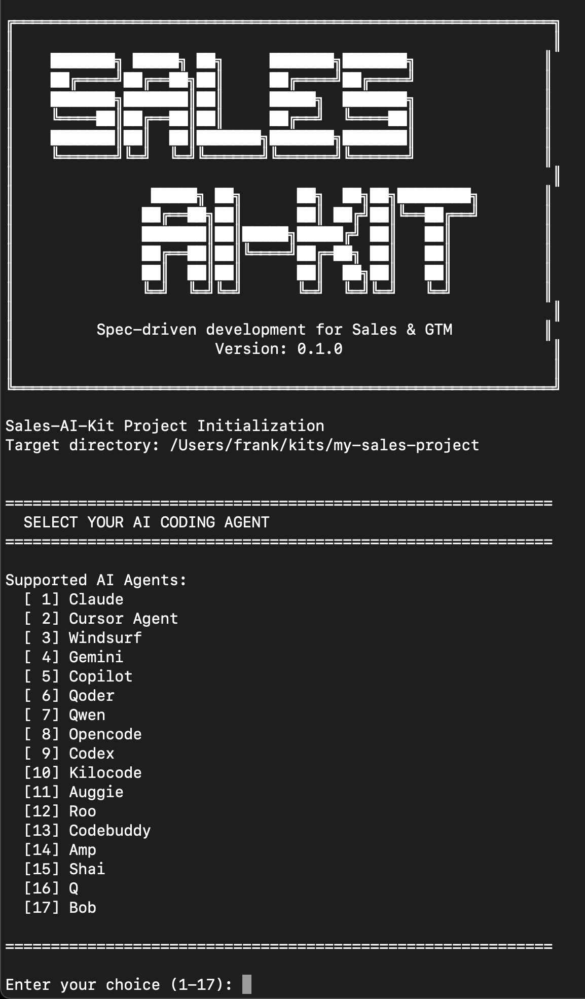
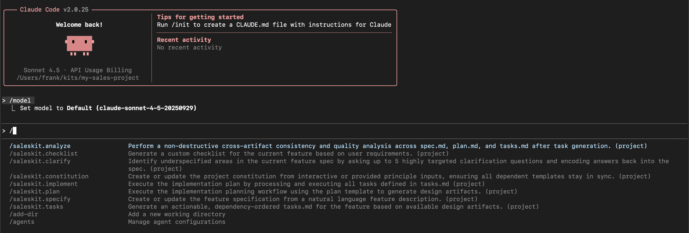

<div align="center">
    <h1>🎯 Sales-AI-Kit</h1>
    <h3><em>Master GTM strategy and execution with AI agents.</em></h3>
</div>

<p align="center">
    <strong>A spec-driven toolkit for systematic sales and marketing execution for AI/LLM SaaS products, built on the foundations of spec-kit.</strong>
</p>

<p align="center">
    <a href="https://github.com/agentii-ai/sales-ai-kit/actions"></a>
    <a href="https://github.com/agentii-ai/sales-ai-kit/stargazers"></a>
    <a href="https://github.com/agentii-ai/sales-ai-kit/blob/main/LICENSE"></a>
    <a href="https://kits.agentii.ai"></a>
</p>

---

## 🎯 What is Sales-AI-Kit?

**Sales-AI-Kit** is a specialized variant of [**Spec-Kit**](https://github.com/github/spec-kit), adapted for go-to-market (GTM) strategy and execution for AI/LLM SaaS products.

While Spec-Kit enables spec-driven software development with AI agents, **Sales-AI-Kit applies the same methodology to the domain of sales, marketing, and GTM execution**—helping founders, sales leaders, and marketers execute systematic, evidence-based GTM strategies with AI-assisted workflows instead of ad-hoc campaigns.

### Key Differences from Spec-Kit

| Aspect | Spec-Kit | Sales-AI-Kit |
|--------|----------|--------------|
| **Focus** | Software feature development | Sales & marketing execution |
| **Primary Workflow** | Specification → Plan → Code → Test | Specification → Strategy → Campaign → Measure |
| **Success Metrics** | Code quality, test coverage, performance | Pipeline velocity, conversion rates, CAC/LTV |
| **Deliverables** | Production software & APIs | GTM artifacts, campaigns, sales materials |
| **CLI Command** | `specify` | `sales` |
| **Agent Commands** | `/speckit.*` | `/saleskit.*` |

---

## 🚀 Get Started

### 1. Install Sales-AI-Kit

Choose your preferred installation method:

#### Option 1: One-Time Usage (Recommended)

Run directly without installing—always uses the latest version:

```bash
uvx --from git+https://github.com/agentii-ai/sales-ai-kit.git sales init my-sales-project
uvx --from git+https://github.com/agentii-ai/sales-ai-kit.git sales namespace
```

> **Note**: This project is improving rapidly. We recommend `uvx` to always get the latest features and fixes.



*Running `sales init` shows an interactive wizard to select your AI assistant*

#### Option 2: Persistent Installation

Install once and use everywhere (may require periodic updates):

```bash
uv tool install sales-cli --from git+https://github.com/agentii-ai/sales-ai-kit.git
```

Then use the tool directly:

```bash
sales init my-sales-project
sales namespace
```

To update to the latest version:

```bash
uv tool install sales-cli --force --from git+https://github.com/agentii-ai/sales-ai-kit.git
```

### 2. Initialize Your First Sales Project

```bash
sales init my-ai-saas-gtm
cd my-ai-saas-gtm
```

This creates a project with Sales-AI-Kit-specific templates, constitution, and agent commands.

### 3. Launch Your AI Agent

Open your AI assistant (Claude Code, Cursor, Windsurf, etc.) in the project directory. You'll see `/saleskit.*` commands available:

```bash
/saleskit.constitution    # Establish GTM-specific principles
/saleskit.specify         # Define your GTM initiative
/saleskit.clarify         # Resolve ambiguities in your strategy
/saleskit.plan            # Create execution plan
/saleskit.tasks           # Generate actionable GTM tasks
/saleskit.implement       # Execute GTM workflow
```



*Claude Code automatically detects all `/saleskit.*` slash commands in your project*

### 4. Run Your First GTM Workflow

```bash
/saleskit.specify Launch enterprise sales motion for AI-powered legal document analysis targeting mid-market law firms
```

This generates a GTM specification with:
- Target ICP definition (firmographics, technographics, behavioral signals)
- Value proposition and positioning
- Sales plays and outreach sequences
- Marketing campaigns and content strategy
- Success metrics (pipeline velocity, conversion rates, CAC/LTV)
- Channel strategy and distribution plan

---

## 🤖 Supported AI Agents

Sales-AI-Kit works with all agents supported by Spec-Kit:

| Agent | Support | Notes |
|-------|---------|-------|
| [Claude Code](https://www.anthropic.com/claude-code) | ✅ | Native support |
| [Cursor](https://cursor.sh/) | ✅ | Full integration |
| [Windsurf](https://windsurf.com/) | ✅ | Complete support |
| [Gemini CLI](https://github.com/google-gemini/gemini-cli) | ✅ | Verified working |
| [GitHub Copilot](https://github.com/features/copilot) | ✅ | Compatible |
| [Qoder CLI](https://qoder.com/cli) | ✅ | Supported |
| Plus 11+ additional agents | ✅ | See Spec-Kit docs |

---

## 📦 Sales-AI-Kit Templates

Sales-AI-Kit provides project templates for 17 AI coding agents, automatically downloaded when you run `sales init`. Each template includes:

- **Sales-AI-Kit Constitution v1.0.0** with 7 GTM-specific principles
- **Workflow templates**: spec.md, plan.md, tasks.md for GTM documentation
- **9 slash commands**: /saleskit.specify, /saleskit.plan, /saleskit.tasks, /saleskit.implement, /saleskit.clarify, /saleskit.analyze, /saleskit.checklist, /saleskit.taskstoissues, /saleskit.constitution
- **Scripts**: Bash or PowerShell variants for automation
- **Memory system**: constitution.md for project-specific principles

### Supported Template Agents

Templates are available for all 17 agents in both bash and PowerShell variants (34 total):

- Claude Code • Cursor Agent • Windsurf • Google Gemini
- GitHub Copilot • Qoder • Qwen • OpenCode
- Codex • KiloCode • Auggie • CodeBuddy
- AMP • Shai • Amazon Q • Bob • Roo

See [GitHub Releases](https://github.com/agentii-ai/sales-ai-kit/releases) for downloadable template archives with SHA-256 checksums.

---

## 🎯 Core GTM Workflow

### Phase 1: Specification (`/saleskit.specify`)

Define **WHAT** you're trying to achieve and **WHY**:
- Target ICP (firmographics, technographics, behavioral signals)
- Value proposition and positioning
- Sales plays and outreach sequences
- Marketing campaigns and content strategy
- Success metrics (pipeline velocity, conversion rates, CAC/LTV)
- Channel strategy and distribution plan

### Phase 2: Clarification (`/saleskit.clarify`)

Resolve ambiguities before committing to execution:
- Validate ICP sharpness
- Clarify value proposition and messaging
- Define success metrics precisely
- Identify unstated assumptions

### Phase 3: Planning (`/saleskit.plan`)

Define **HOW** you'll execute GTM:
- Campaign timeline and milestones
- Resource allocation and budget
- Content creation and asset production
- Sales enablement materials
- Measurement framework and dashboards

### Phase 4: Task Breakdown (`/saleskit.tasks`)

Generate actionable GTM tasks:
- Build target account lists
- Create sales collateral and pitch decks
- Execute outreach campaigns
- Develop marketing content
- Set up tracking and analytics

### Phase 5: Execution (`/saleskit.implement`)

Execute GTM systematically with AI assistance:
- Deploy campaigns and outreach sequences
- Track pipeline and conversion metrics
- Optimize messaging and targeting
- Document learnings and iterate

---

## 🌟 Sales-AI-Kit Constitution

Sales-AI-Kit is built on 7 core principles that guide all GTM work:

### I. Specification-First Approach
Define strategy and success criteria **before** launching campaigns.

### II. Data-Evidence-Driven
Support all GTM claims with data and customer evidence—not opinions or assumptions.

### III. Iterative Optimization
Follow plan-execute-measure-learn cycles with independent, testable increments.

### IV. Minimal Viable Process
Use the simplest approach that achieves the GTM objective.

### V. Cross-Functional Integration
Integrate insights from sales, marketing, product, customer success, and engineering.

### VI. Kit Namespace Isolation
Enable multiple kit variants (`sales-ai-kit`, `pmf-kit`, `blog-kit`) to coexist without conflicts.

### VII. Template Extensibility
Serve as a reference implementation for creating domain-specific kit variants.

See [`.saleskit/memory/constitution.md`](./.saleskit/memory/constitution.md) for full details.

---

## 📚 Reference Documentation

Sales-AI-Kit includes comprehensive reference materials to guide your GTM execution:

- **`refs/0_overview.md`** - Overview of GTM strategy for AI/LLM SaaS products
- **`refs/1_principles_for_constitution.md`** - GTM-specific principles and patterns
- **`refs/2_define_for_specify.md`** - How to structure sharp GTM specifications
- **`refs/3_project_management_for_plan.md`** - GTM planning methodology
- **`refs/4_pm_tasking_for_tasks.md`** - GTM execution task patterns
- **`refs/instructions.md`** - How to create your own kit variants

---

## 🔧 Multi-Kit Installation

Sales-AI-Kit is designed to coexist with Spec-Kit and other kit variants:

```bash
# Install Spec-Kit for software development
uv tool install specify-cli --from git+https://github.com/github/spec-kit.git

# Install Sales-AI-Kit for GTM execution
uv tool install sales-cli --from git+https://github.com/agentii-ai/sales-ai-kit.git

# Both tools work independently
specify namespace    # Shows Spec-Kit configuration
sales namespace      # Shows Sales-AI-Kit configuration

# Create projects with different kits
specify init my-feature           # Software feature project
sales init my-gtm-campaign        # GTM execution project
```

In your AI agent, both command namespaces are available:
- `/speckit.*` commands for software development workflows
- `/saleskit.*` commands for GTM execution workflows

---

## 🎛️ CLI Reference

### `sales init` - Initialize Sales Project

```bash
sales init <PROJECT_NAME>
sales init my-sales-project --ai claude
sales init . --here --force        # Initialize in current directory
sales init my-project --ai cursor --script ps1   # PowerShell scripts
```

**Options:**
- `--ai` - Specify AI assistant (claude, cursor, windsurf, gemini, etc.)
- `--script` - Script variant (sh for bash/zsh, ps1 for PowerShell)

### `sales namespace` - Verify Installation

```bash
sales namespace
```

Verifies Sales-AI-Kit installation and displays namespace configuration for multi-kit coexistence.

### `sales version` - Show Version

```bash
sales version
```

Displays the current Sales-AI-Kit version.

---

## 🚀 Examples by GTM Motion

### Enterprise Sales Motion

```bash
sales init enterprise-saas-sales
/saleskit.specify "Launch enterprise sales motion for AI-powered contract analysis targeting mid-market law firms"
```

Expected artifacts:
- ICP: 50-500 person law firms, $10M-$100M revenue, using legal tech
- Sales play: CFO + GC outreach with ROI calculator
- Positioning: "Reduce contract review time by 80% with AI-powered analysis"
- Success metrics: $500K pipeline in 90 days, 15% demo-to-close rate

### Product-Led Growth Motion

```bash
sales init plg-motion
/saleskit.specify "Design self-serve onboarding for AI code assistant targeting individual developers"
```

Expected artifacts:
- ICP: Backend/fullstack developers at tech companies
- Activation funnel: Sign up → First code generation → 5 completions → Weekly active
- Growth loops: Viral invites, public code snippets, GitHub integration
- Success metrics: 40% D7 retention, 10% free-to-paid conversion

### Content Marketing Campaign

```bash
sales init content-campaign
/saleskit.specify "Launch thought leadership campaign for AI-powered sales intelligence platform"
```

Expected artifacts:
- Content strategy: Weekly blog posts, monthly webinars, quarterly reports
- Distribution channels: LinkedIn, HN, industry publications
- Lead magnets: ROI calculators, industry benchmarks, playbooks
- Success metrics: 10K monthly visitors, 5% visitor-to-lead conversion

---

## 📖 Learn More

- **[Sales-AI-Kit Specification](./specs/001-saleskit-variant/spec.md)** - Full feature specification
- **[Sales-AI-Kit Implementation Plan](./specs/001-saleskit-variant/plan.md)** - Technical implementation details
- **[Spec-Kit Repository](https://github.com/github/spec-kit)** - Upstream project for software development
- **[Spec-Driven Development Methodology](https://github.com/github/spec-kit/blob/main/spec-driven.md)** - Core methodology

---

## 🏗️ Project Structure

```
sales-ai-kit/
├── .saleskit/                    # Kit source templates
│   ├── memory/
│   │   └── constitution.md       # Sales-AI-Kit principles (v1.0.0)
│   ├── templates/
│   │   ├── spec-template.md      # GTM specification template
│   │   ├── plan-template.md      # GTM planning template
│   │   ├── tasks-template.md     # GTM task breakdown template
│   │   └── commands/             # Agent command templates
│   │       ├── saleskit.specify.md
│   │       ├── saleskit.plan.md
│   │       ├── saleskit.tasks.md
│   │       ├── saleskit.implement.md
│   │       ├── saleskit.clarify.md
│   │       ├── saleskit.analyze.md
│   │       ├── saleskit.checklist.md
│   │       └── saleskit.constitution.md
│   └── scripts/
│       ├── bash/                 # Bash automation scripts
│       └── powershell/           # PowerShell automation scripts
├── src/saleskit/                 # CLI implementation
│   ├── __init__.py
│   └── cli.py                    # sales command
├── .github/workflows/            # CI/CD workflows
│   ├── release.yml               # Template release automation
│   └── scripts/                  # Build and release scripts
├── specs/                        # Feature specifications
│   └── 002-saleskit-auto-template-release/
└── refs/                         # Reference documentation
```

---

## 🔧 Prerequisites

- **Linux/macOS/Windows**
- [Supported](#-supported-ai-agents) AI coding agent
- [uv](https://docs.astral.sh/uv/) for package management
- [Python 3.11+](https://www.python.org/downloads/)
- [Git](https://git-scm.com/downloads)

### Verify Your Setup

Run `sales namespace` to verify installation and namespace configuration:

```bash
sales namespace
```

---

## 🌐 Creating Your Own Kit Variant

Sales-AI-Kit demonstrates how to adapt spec-driven methodology to any domain. Want to create a variant for product design, operations, or customer success?

See [`refs/instructions.md`](./refs/instructions.md) for a comprehensive guide on:
- How to fork and adapt spec-kit for your domain
- How to define domain-specific principles
- How to create templates and reference materials
- How to enable multi-kit coexistence

**Example variants:**
- **`pmf-kit`** - Product-market-fit discovery and validation
- **`blog-kit`** - Technical content and blog creation
- **`ops-kit`** - Operations and project management
- **`cs-kit`** - Customer success and support

All variants are published at [**kits.agentii.ai**](https://kits.agentii.ai).

---

## 🙏 Acknowledgements

Sales-AI-Kit is built on the excellent work of the [**Spec-Kit**](https://github.com/github/spec-kit) project from GitHub. We preserve 100% of Spec-Kit's architecture and infrastructure while adapting templates and methodology for GTM execution.

**Spec-Kit Credits:**
- [Den Delimarsky](https://github.com/localden)
- [John Lam](https://github.com/jflam)

---

## 💬 Support

For issues, questions, or feedback:

- **GitHub Issues**: [Report on Sales-AI-Kit](https://github.com/agentii-ai/sales-ai-kit/issues)
- **Spec-Kit Issues**: [Report on Spec-Kit](https://github.com/github/spec-kit/issues)
- **Kit Variants**: [Visit kits.agentii.ai](https://kits.agentii.ai)

---

## 📄 License

This project is licensed under the terms of the MIT open source license. See [LICENSE](./LICENSE) for details.

**Note**: Sales-AI-Kit extends Spec-Kit's MIT license. For Spec-Kit license details, see [Spec-Kit LICENSE](https://github.com/github/spec-kit/blob/main/LICENSE).

---

## 🌟 Why Sales-AI-Kit?

### For Sales Leaders & Marketers:
- **Systematic**: Replace ad-hoc campaigns with structured, spec-driven GTM execution
- **AI-Assisted**: Leverage AI agents for strategy, planning, and execution
- **Evidence-Based**: Focus on data and customer evidence, not opinions
- **Repeatable**: Create reusable playbooks and templates for consistent execution

### For the Open Source Community:
- **Reproducible**: Spec-driven workflows are more transparent and collaborative than ad-hoc processes
- **Extensible**: Sales-AI-Kit serves as a reference for creating domain-specific kit variants
- **Community-Friendly**: All templates and reference materials are open source and MIT-licensed
- **Professional**: Built on proven Spec-Kit infrastructure, adapted by experienced GTM leaders

---

**Ready to execute GTM with confidence?**

```bash
sales init my-sales-project
```

Let's build systematic, evidence-based GTM strategies that scale.

---
